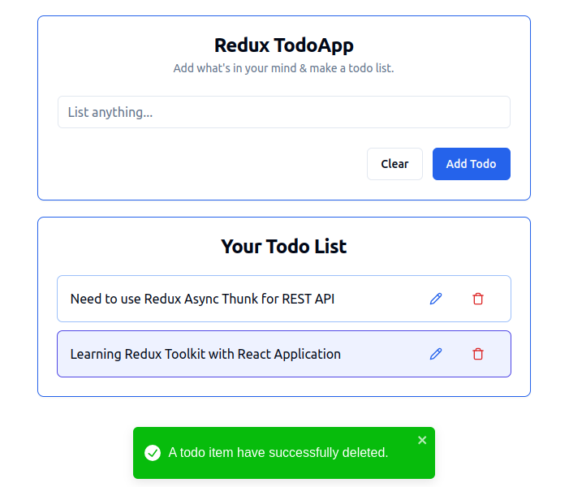

<center>
<h1>
Redux Todo App
</h1>
</center>


I have created a [Redux Todo App](https://redux-toolkit-todoapp.netlify.app/) where I use a React Application align with Redux Toolkit. It's a REST API application where user can fetch the existing remaining todo task (`GET` operation), enter any todo task (`POST` operation) update the existing todo task (`PUT` operation) & delete any todo task (`DELETE` operation)

## Tech Stack

**Client:**

- Framework: React JS
- Language: Typescript
- State Management: Redux, Redux Toolkit
- CSS Framework (UI): Tailwind CSS
- CSS Library (UI): Shadcn UI

**Server:**

- Database: Firebase

## Features

- REST API features
  - User can enter a todo task
  - Update a todo task
  - Fetch existing todo task
  - Delete any existing todo task
- GET features
  - User can fetch existing todo task
  - If no existing task is present, user can view an empty list
  - If something went wrong, user can view an error component with error toast
- POST features
  - User can enter a todo list
  - Empty input can not be applicable
  - Entered input must be within 50 letters, otherwise user will show a info toast
  - User can clear entered input before submission
  - After successful submission, user can view a success toast message
  - User can not able to submit more than 5 todo tasks
- PUT features
  - User can edit existing todo task
  - Same task name can not be applicable
  - Empty input can not be applicable
  - Entered input must be within 50 letters, otherwise user will show a info toast
  - After successful edition, user can view a success toast message
  - After edition, a todo task will be highlighted
- DELETE features
  - User can delete any todo task
  - After successful deletion, user can view a success toast message

## Screenshots

### GET features

At the beginning of the application, user will fetch existing todo tasks.


If no task is present, user can view an empty todo task.


### POST features

User can enter a todo list.


### PUT features

User can edit existing todo task.


After successful edition, user can view highlighted todo task with success toast.


### DELETE features

After selecting a specific todo task for deletion, a delete dialog will open for confirmation.


fter successful deletion, user can view a success toast message.



## Deployment

I have deployed my project in Netlify website. Visit & investigate the application using the following hosted link.

[ReduxTodo App](https://redux-toolkit-todoapp.netlify.app/)

## Lessons Learned

What did you learn while building this project? What challenges did you face and how did you overcome them?

- Will disclose later

## Environment Variables

To run this project, you will need to add the following environment variables to your `.env` file

`VITE_BASE_URL`

`VITE_DB`

## Run Locally

Clone the project

```bash
  git clone git@github.com:PrinceCuet77/ReduxTodoApp.git
```

Go to the project directory

```bash
  cd my-project
```

Install dependencies

```bash
  npm i
```

Start the server

```bash
  npm run start
```

## Author

- Github: [PrinceCuet77](https://github.com/PrinceCuet77)
- Email: [prince.cuet.77@gmail.com](mailto:prince.cuet.77@gmail.com)
- Linkedin: [Rezoan Shakil Prince](https://www.linkedin.com/in/rezoan-shakil-prince/)

## Related

Here are some related projects

- To be disclosed later
